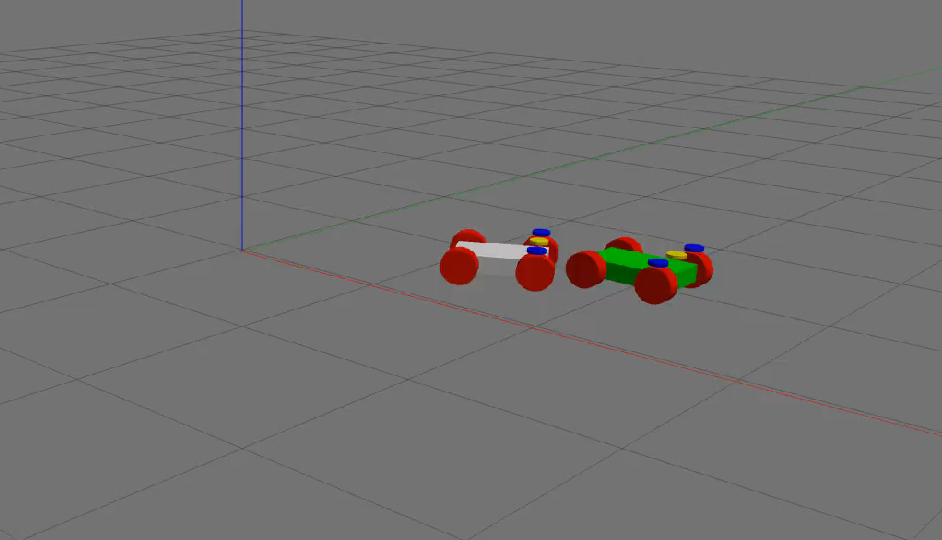

# follow_bot

Simulation of two Ackermann steering vehicles in Gazebo using ROS Noetic, where one follows the other.



The vehicle models are provided by Rhys Mainwaring's [steer_bot](https://github.com/srmainwaring/steer_bot), which uses `ackermann_steering_controller` and `steer_bot_hardware_gazebo`.

## Setup
Once you've cloned the repo, pull the dependencies into the `src` folder:

```sh
git clone https://github.com/srmainwaring/steer_bot src/steer_bot
git clone https://github.com/tsedl/steer_drive_ros.git --branch melodic-devel --single-branch src/steer_drive_ros
```

Then, install the necessary dependencies:
```sh
apt install -y ros-noetic-teleop-twist-keyboard
rosdep check --from-paths src --ignore-src --rosdistro noetic
rosdep install --from-paths src --ignore-src --rosdistro noetic -y
```

Finally, build the project.

```sh
catkin_make
```

## Running
Set up the correct environment variables and start the simulation:

```sh
source devel/setup.bash
roslaunch follow_bot sim.launch
```

Then, in a new terminal, launch a keyboard input node to control the robot being followed.

```sh
rosrun teleop_twist_keyboard teleop_twist_keyboard.py cmd_vel:=/steer_bot/ackermann_steering_controller/cmd_vel _speed:=2 _turn:=1.57
```

Use the u, i, o keys to move the robot, and watch the follower chase after it!